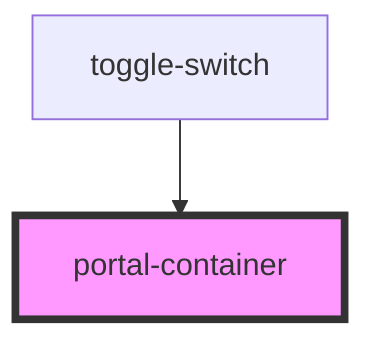

# portal-container

<!-- Auto Generated Below -->

## Properties

| Property | Attribute | Description | Type     | Default |
| -------- | --------- | ----------- | -------- | ------- |
| `count`  | `count`   |             | `number` | `0`     |

## Events

| Event   | Description | Type                   |
| ------- | ----------- | ---------------------- |
| `count` |             | `CustomEvent<boolean>` |

## Dependencies

### Used by

 - [toggle-switch](../toggle-switch)

### Graph

----------------------------------------------

*Built with [StencilJS](https://stenciljs.com/)*
