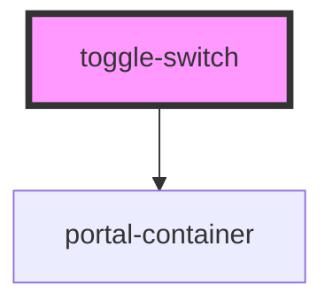

# toggle-switch

<!-- Auto Generated Below -->

## Properties

| Property   | Attribute  | Description | Type      | Default     |
| ---------- | ---------- | ----------- | --------- | ----------- |
| `checked`  | `checked`  |             | `boolean` | `undefined` |
| `disabled` | `disabled` |             | `boolean` | `false`     |
| `type`     | `type`     |             | `string`  | `undefined` |

## Events

| Event                 | Description | Type                   |
| --------------------- | ----------- | ---------------------- |
| `toggle-change-event` |             | `CustomEvent<boolean>` |

## Dependencies

### Depends on

- [portal-container](../portal)

### Graph

----------------------------------------------

*Built with [StencilJS](https://stenciljs.com/)*
